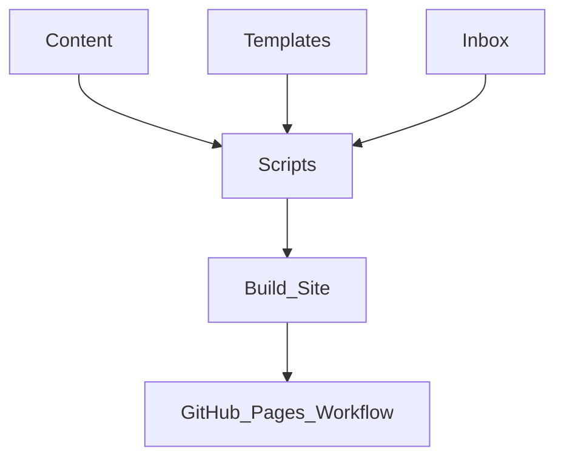

## Stack
- Not a code project — a personal Markdown knowledge vault (notes as content).
- Tooling: Python 3 (stdlib only) for scaffolding/generation scripts (`scripts/*.py`).
- Site build: MkDocs Material (`mkdocs.yml`, `requirements-docs.txt`), staged via `scripts/build_site.sh`.
- Deploy: GitHub Actions (`.github/workflows/deploy-docs.yml`) to GitHub Pages.

## Directory map
| path | what lives there |
|---|---|
| `journal/` | dated learning log entries, e.g. `journal/2026/2026-06-25.md` |
| `topics/` | evergreen distilled notes by subject (computer-science, programming, networking, software-development) |
| `courses/` | source-based capture, e.g. `courses/aiub/2026-spring` |
| `planner/` | goals, habits (`planner/habits/`), weekly reviews (`planner/weekly/`) |
| `resources/` | books.md, courses.md — pointers to external material |
| `_templates/` | note templates: daily-log, topic-note, weekly-review, habit-month, resource |
| `_inbox/` | JSON input files consumed by `scripts/generate_notes.py`, e.g. `_inbox/example.json` |
| `scripts/` | `new.py`, `generate_notes.py`, `diary_lib.py`, `build_site.sh`, `enrich_site.py` |
| `.github/workflows/` | `deploy-docs.yml` — CI build/deploy |

## Diagram

## Component index
- [[Content]]
- [[Templates]]
- [[Inbox]]
- [[Scripts]]
- [[Build_Site]]
- [[GitHub_Pages_Workflow]]

## Entry points
- Dev: `python3 scripts/new.py <daily|topic|weekly|habit|resource>` (per README.md); `python3 scripts/generate_notes.py` for `_inbox/*.json`.
- Dev preview site: `bash scripts/build_site.sh serve` → http://127.0.0.1:8000 (per README.md).
- Prod: push to `main` → `.github/workflows/deploy-docs.yml` rebuilds/redeploys (per README.md).

## Conventions
- Filenames: lowercase `kebab-case`, no spaces (README.md "Conventions").
- Dates: ISO format `YYYY-MM-DD` everywhere (README.md).
- Every folder has a `README.md` for GitHub landing pages (README.md; observed in `journal/`, `planner/`, `resources/`, `courses/`, `topics/`, `_inbox/`).
- Every note starts with YAML frontmatter (title, date, tags, source, status) — templates in `_templates/` are the source of truth (README.md, `scripts/new.py` docstring).
- Links are relative Markdown links; `[[wiki links]]` used for backlinks, resolved by the `roamlinks` mkdocs plugin (README.md, `mkdocs.yml`).
- `docs/` and `site/` are build output, gitignored, staged by `scripts/build_site.sh` — do not edit directly (`mkdocs.yml` comment, README.md).
- `scripts/new.py` imports shared helpers from `scripts/diary_lib.py` (`REPO_ROOT`, `TEMPLATES_DIR`, `TOPICS_DIR`, `refresh_index`, `slugify`, `yaml_quote`).

## Where things go
- To add a new topic note: `python3 scripts/new.py topic <subject> "<title>"`, which writes into `topics/<subject>/` and refreshes that subject's `README.md` index (`scripts/new.py`).
- To add a new daily/weekly/habit entry: use `scripts/new.py daily|weekly|habit`, which scaffolds from `_templates/` into `journal/`, `planner/weekly/`, or `planner/habits/`.
- To bulk-generate notes: drop a JSON file into `_inbox/` (format in `_inbox/README.md`) and run `scripts/generate_notes.py`.
- To change note structure: edit the relevant file in `_templates/` (source of truth per `scripts/new.py` docstring).
- To change the published site: edit `mkdocs.yml`, `scripts/build_site.sh`, `scripts/enrich_site.py`, or `.github/workflows/deploy-docs.yml`.
